# Why TAO?
## Before TAO
- Data stored in MySQL and cached in memcached
- Caching managed by apps
## Problems
- Operations on lists are inefficient in memcached (update whole list)
- Complexity of clients managing cache
- Hard to offer read-after-write consistency
## What is TAO?
TAO is a storage system for graphs that manages both durability and caching
- Unlike memcached, it’s a `write-through` cache
- Unlike both memcached and MySQL, API explicitly involves graph concepts
Eventually consistent, but “read-after-write” in many common cases
## What problem TAO tries to sloves?
- Efficiency at scale
- Low read latency
- Timeliness of write
- High read availability, for example Facebook has 0.2% write and 98.2% read.
## Why you should not use TAO?
- Write heavy application
# Data model
## Objects i.e. Nodes
Follownig are few example
- User
- Place
- Comment
- Checkin
To handle the volume, all IDs are 64 bits long
Largest size of nodes: 1MB

## Associations i.e Edges
Following are few example
- TAGGED
- LIKES
- LIKED_BY
Every edge has time.
## Example
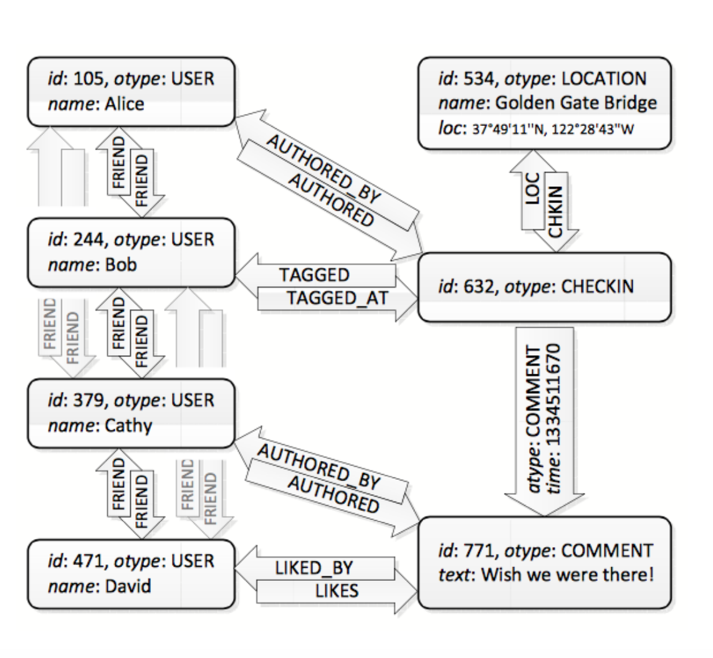
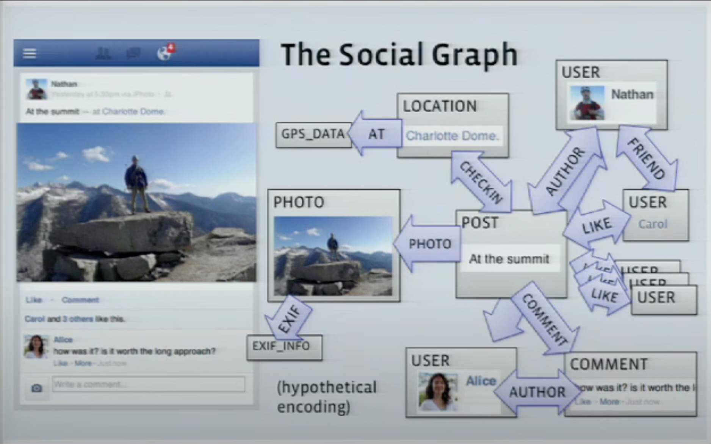
# How facebook render graph?
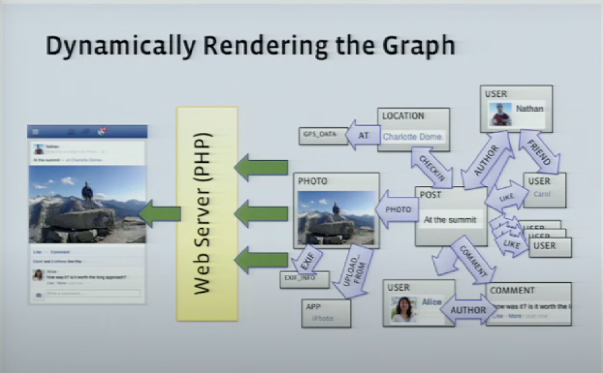
- It doesn't use cached data
- All graph data is stored in in memory storage
- Read/Writes are directly perfrom from in memory storage
- Reason for not using cached data is following
    - Most of the queries are personalzied to user
    - Show fresh content as soon as possible
# Dynamic Resolution of Data dependencies
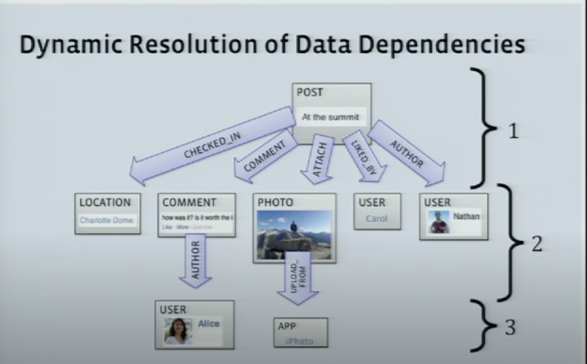
# Architecture
## High level system design 
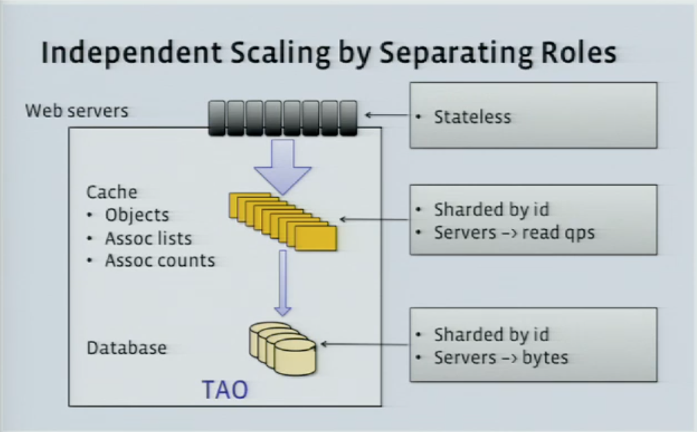
## Simple Data Center
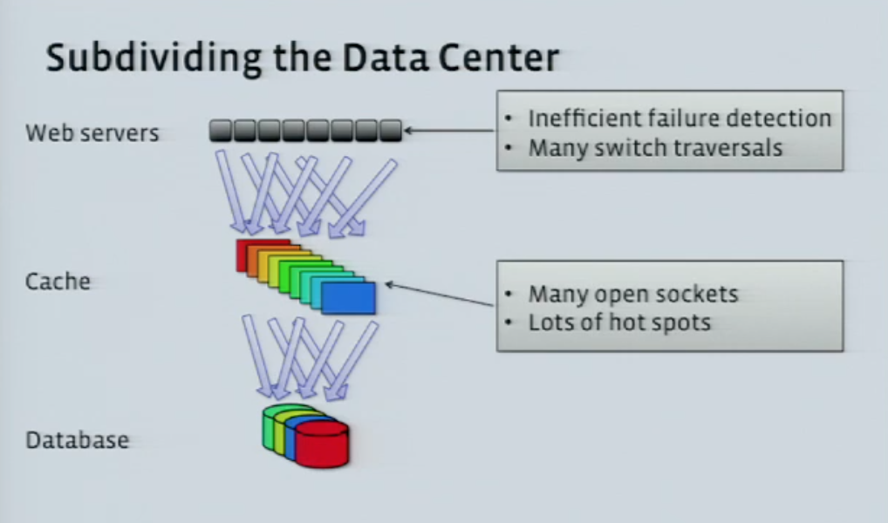
## Subdividing the Data Center
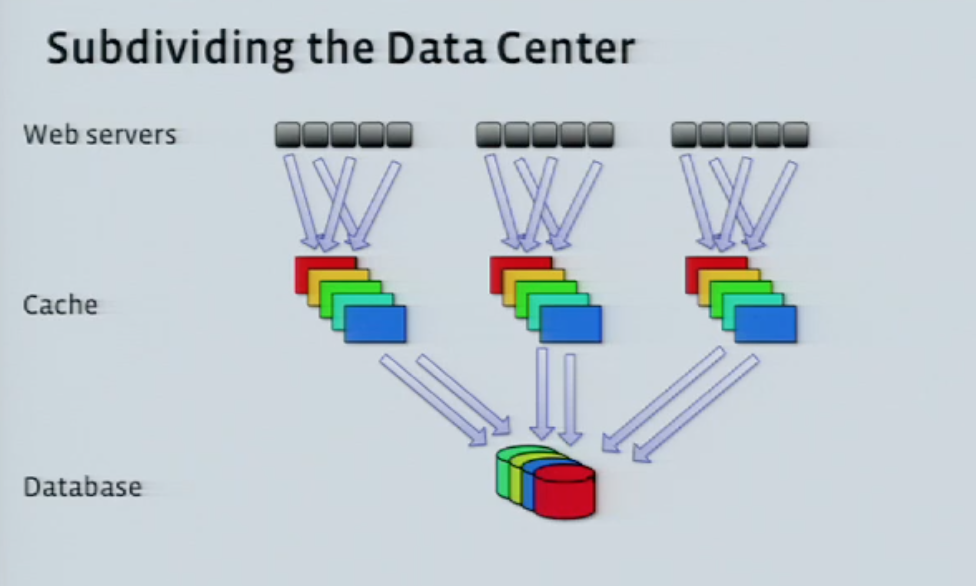
## Problem with Subdivided data center
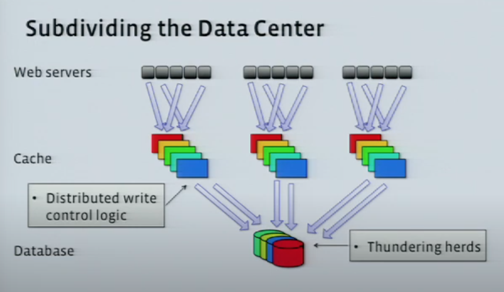
- Distributed write control logic
- Thundering herds
## Follower and Leader Caches
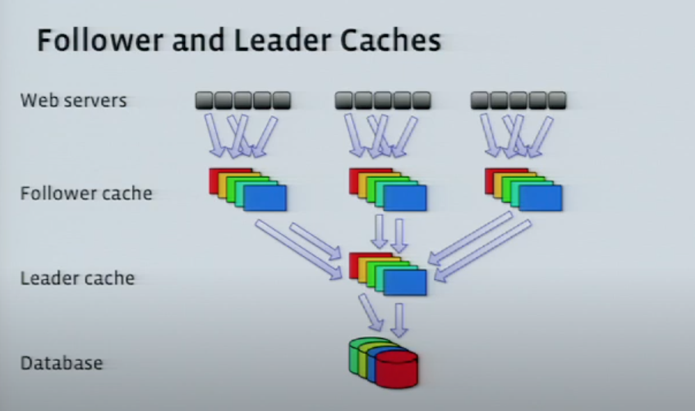
## Write through cache - association list
- For Object, send invalidate message to replace old data
- For association, send refill signal to let follower to reload from leader
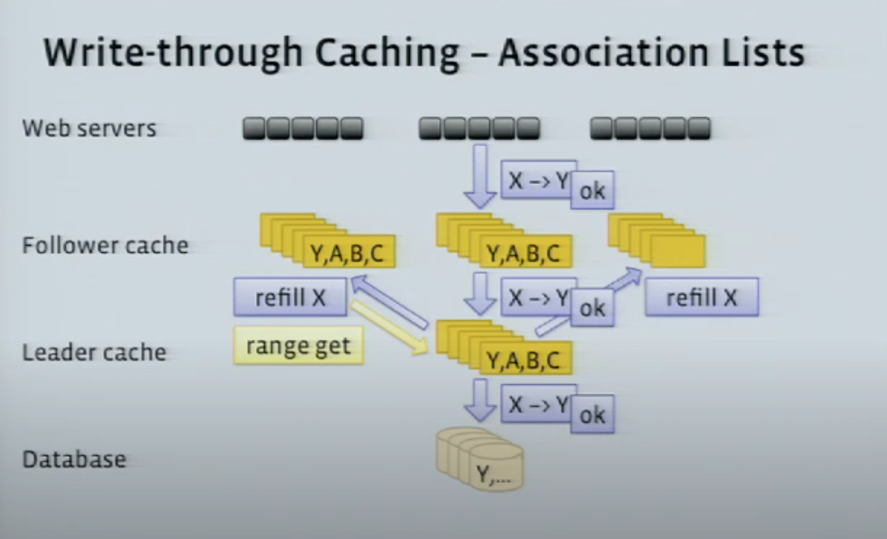
## Asynchronous DB Replication
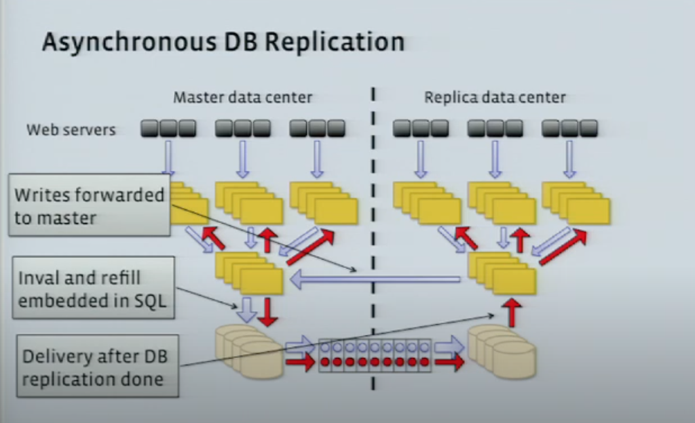
- All writes first goes to leader
- After leader makes commit to cache, it also writes into MySQL database
- Once data is written to db, signal is send to follower cache to either invalidate object or refill association
## Improve Availability
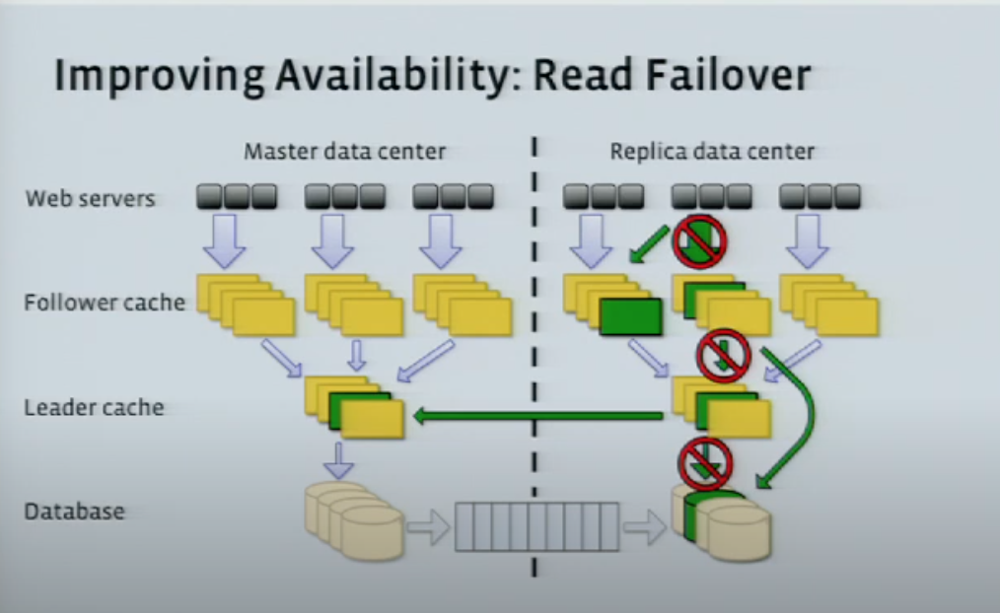
- Read can be performed from multiple servers
- If reading from webserver and if unable to talk to correct machine on follover cache
    - it will redirect to other follower to read data
- If we can't read leader cache then read directly from database
    - It might have stale data, but eventually once leader is back then MySQL will have latest data.
- If we can't talk to replica MySQL then it will read from master data center MySQL
    - Proxy request cross country/atlantic
    - It also helps to do the database maintanance 
# API
Following are operations on Object and Associations
- create
- update
- delete

Following are few example of association queries
- association_get(id1, type, id2set, high?, low?)
    - List associations between specific Ids
- association_count(id1, type)
    - count associations
- association_range(id1, type, pos, limit)
    - list all association by position
- association_time_range(id1, type, high, low, limit)
    - list associations in time range
After retrieval, all results are fitlered by privacy controls.

# Partitioning
- Objects are allocated to fix `shards` via their object id. These may move across databases etc after creation.
- Associations (id1, type, id2) stored on same shard as object id1
- One master cache server is responsible for each shard and its associations.

# Consistency
Consistency is eventual only. some reason include
- Master slave replication of MySQL
- Secondary cache can be behind primary cache
- Some writes touches two items (eg. maintaing inverse edges)
# Reference
https://www.usenix.org/system/files/conference/atc13/atc13-bronson.pdf

https://medium.com/coinmonks/tao-facebooks-distributed-database-for-social-graph-c2b45f5346ea

https://pdfs.semanticscholar.org/1cae/7d67861d664588e737cab8dbf644033fcd93.pdf

https://www.youtube.com/watch?v=sNIvHttFjdI&t=20s&ab_channel=USENIX
